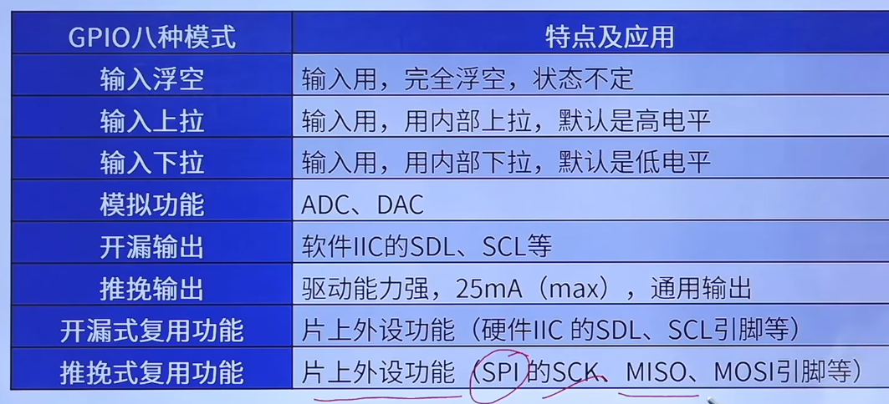

# GPIO八种模式

## GPIO内部电路图

## 一、输入浮空

- 上拉电阻关闭
- 下拉电阻关闭
- 施密特触发器打开
- 双MOS管不导通

特点：空闲时（外部io为高阻态），由外部环境决定

## 二、输入上拉

- 上拉电阻打开
- 下拉电阻关闭
- 施密特触发器打开
- 双MOS管不导通

特点：空闲时，IO呈现高电平

## 三、输入下拉

- 上拉电阻关闭
- 下拉电阻打开
- 施密特触发器打开
- 双MOS管不导通

特点：空闲时，IO呈现低电平

## 四、模拟功能

- 上拉电阻关闭
- 下拉电阻关闭
- 施密特触发器关闭
- 双MOS管不导通

 特点：专门用于模拟信号输入或输出，如：ADC和DAC

## 五、开漏输出

- 上拉电阻关闭
- 下拉电阻关闭
- 施密特触发器打开
- P-MOS管始终不导通
- 往ODR对应位写0，N-MOS管导通，**写1则N-MOS管不导通**，需要外部上拉电路来输出高电平

特点：不能输出高电平，必须有外部（或内部）上拉才能输出高电平

## 六、开漏式复用功能

- 上拉电阻关闭
- 下拉电阻关闭
- 施密特触发器打开
- P-MOS管始终不导通

由片上外设控制输出

特点：1、不能输出高电平，必须有外部（或内部）上拉才能输出高电平，2、由其他外设控制输出

## 七、推挽输出

- 上拉电阻关闭
- 下拉电阻关闭
- 施密特触发器打开

- 往ODR对应位写0，N-MOS管导通，写1则P-MOS管不导通

特点：可以输出高低电平，驱动力强

## 八、推挽式复用功能

- 上拉电阻关闭
- 下拉电阻关闭
- 施密特触发器打开

特点：可以输出高低电平，驱动力强，由其他外设控制输出

**综上，stm32内部不能输出5v，需要依赖外部上拉电路才可以**
